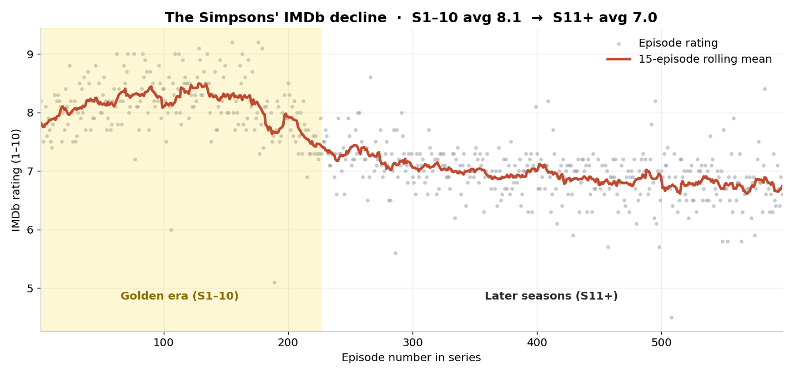
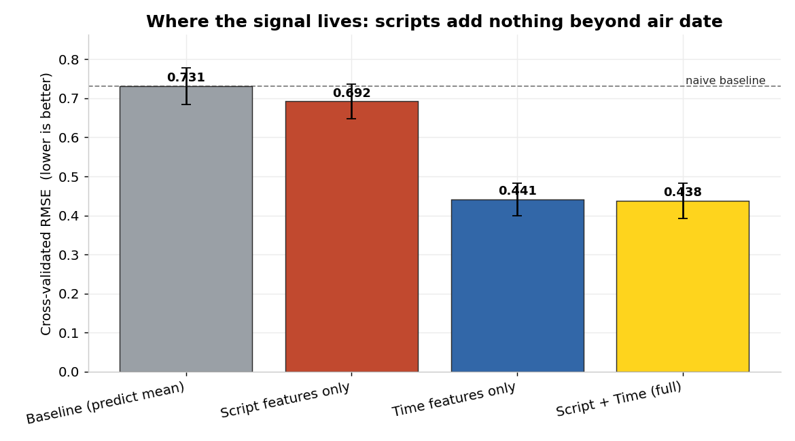
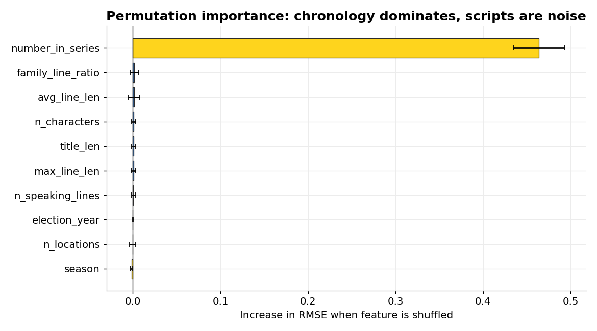
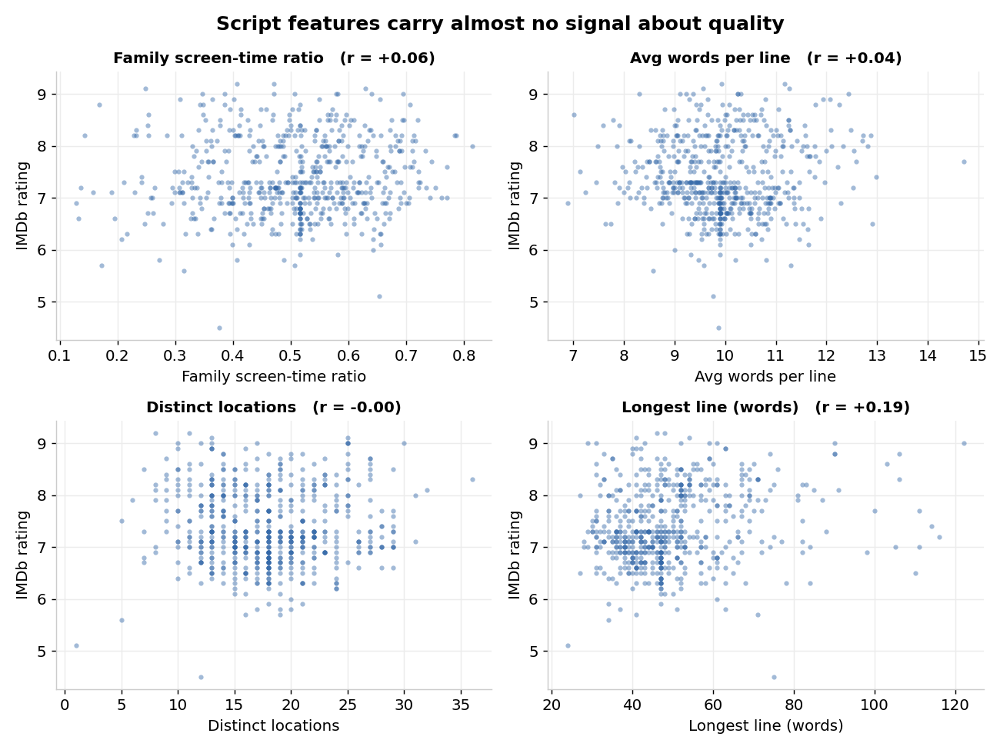
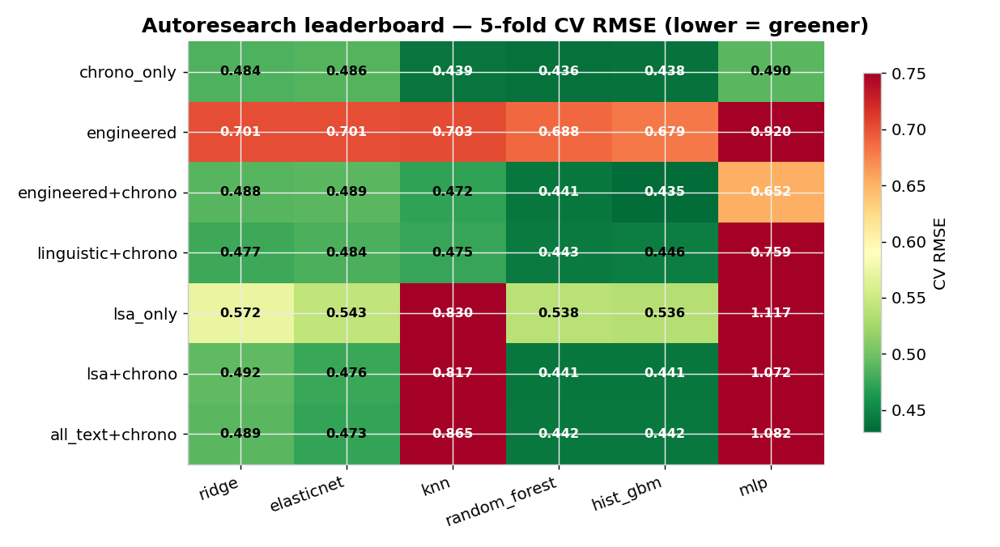
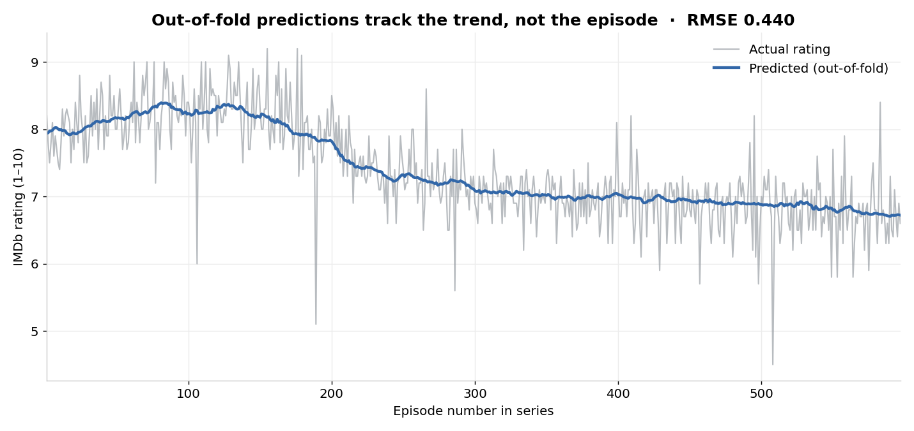

# Can a Simpsons script tell you how good the episode is?

**Short answer: no — and proving that rigorously is the interesting part.**

This repository started life in 2017 as a portfolio project that claimed to
*predict an episode's IMDb rating from its script* with an RMSE of 0.351. This
is a 2026 rebuild. With leak-free methodology and an automated model search, the
honest answer turns out to be very different — and, I'd argue, far more
interesting than the original headline.

> **Headline finding.** Across **42 model × feature-set combinations** — shallow
> engineered features, hand-built linguistic features, and TF-IDF/LSA *semantic
> embeddings* of the full dialogue, run through linear models, tree ensembles
> and a neural net — the best honest (nested-CV) error is **RMSE ≈ 0.44**. A
> model that knows *only when the episode aired* scores **0.436**. Everything the
> scripts add on top of that is **< 0.005 RMSE — statistical noise.** The
> Simpsons' rating is almost entirely a function of *its decline over time*, not
> the content of any individual episode. Having Claude **read and judge** each
> script is the strongest *content* signal of all (RMSE 0.503 vs. 0.54 for
> embeddings) — but, evaluated blind, it still does **not** beat knowing the air
> date (0.438), and only nudges the best combined RMSE to **0.430**
> ([see below](#beating-chronology-can-claude-read-the-script)).



---

## TL;DR for the busy reviewer

| | Original (2017) | This rebuild (2026) |
|---|---|---|
| Reported RMSE | 0.351 | **0.439 ± 0.050** (nested CV); **0.430** with LLM script-reading |
| How it was obtained | overnight `while` loop saving the best **holdout** draw | nested cross-validation; the search never sees its own test fold |
| Target leakage | `imdb_rating` NaNs imputed with the mean, then scored | episodes with no rating are **dropped**, never imputed |
| Stacking | AdaBoost → GBM fed **in-sample** base predictions | single tuned booster; stacking gave no honest lift |
| Headline claim | "scripts predict ratings" | counts/embeddings add **<0.005**; an LLM *reading* the script is the best content signal (0.503) but still loses to air date (0.438) |
| Runs today? | ❌ imports the long-removed `sklearn.externals.joblib` | ✅ scikit-learn ≥ 1.5, one `pip install` |

The original code is preserved unchanged in [`legacy/`](legacy/) so the before/after is auditable.

---

## What the data actually says

The dataset is [The Simpsons by the Data](https://data.world/data-society/the-simpsons-by-the-data):
**600 episodes** (597 with an IMDb rating) and **158,314 script lines**.

Three facts drive everything:

1. **Ratings are dominated by time.** Rating correlates **−0.75** with episode
   order. The "golden era" (S1–10) averages **8.1**; season 11 onward averages **7.0**.
2. **The naive baseline is already hard to beat.** Ratings have a standard
   deviation of **0.73**, so "always predict the mean" gives RMSE ≈ 0.73. Any
   honest model has only ~0.73 of headroom to work with.
3. **Script-derived features barely move that baseline.** On their own they get
   to ~0.68 — a rounding error better than guessing.



Permutation importance makes it unambiguous: shuffle `number_in_series` and the
model falls apart; shuffle any script feature and nothing happens.



The script features themselves are flat clouds against rating — there is simply
no relationship to learn:



---

## Autoresearch: an automated, honest model search

Per Andrej Karpathy's *[A Recipe for Training Neural Networks](http://karpathy.github.io/2019/04/25/recipe/)* —
establish a dumb baseline, change one thing at a time, and **don't fool
yourself** — `scripts/autoresearch.py` sweeps every feature representation
against every model family, tuning each with an inner cross-validated search,
then **re-scores the winner with nested CV** so hyperparameter selection can't
leak into the reported number. (That guard is exactly what the original
overnight loop lacked.)

**7 feature sets × 6 model families = 42 honestly-scored pipelines:**



Read the heatmap top-to-bottom and the conclusion jumps out:

- **Anything green requires chronology.** The `engineered`-only row (no time) is
  uniformly orange/red. The moment you add `chrono`, every text variant
  collapses into the same ~0.44 band.
- **Semantic embeddings do extract real signal — just redundant signal.** LSA
  embeddings *alone* reach **0.536**, comfortably beating the 0.73 baseline and
  the 0.68 of shallow features. So dialogue genuinely carries information about
  quality — but it's information chronology already encodes, so it adds nothing
  on top.
- **The neural net is the worst model on the board** (0.49 → 1.12). With only
  ~597 examples and 100-dim inputs, an MLP overfits; this is a small-data regime
  where Karpathy's "don't be a hero" rule favours regularized linear models and
  boosted trees (a dedicated PyTorch search later confirmed this — see below).
- **Winner: `engineered + chrono` + HistGradientBoosting**, inner-CV RMSE
  **0.435**, **nested-CV RMSE 0.439 ± 0.050**. `chrono_only` scores 0.436. The
  gap between them — and between the optimistic 0.435 and the honest 0.439 — is
  the search-optimism the original project mistook for a real result.



The out-of-fold predictions track the multi-year *trend* beautifully and are
essentially blind to episode-to-episode variation — visual confirmation that the
model is a chronology estimator wearing a script-analysis costume.

### Does a deep net do better? No. (`scripts/autoresearch_dl.py`)

A PyTorch MLP, searched Karpathy-style — overfit a tiny batch first to prove the
training loop learns (train RMSE → ~0.12 ✓), then standardize, regularize
(dropout, weight decay, early stopping), and random-search 16 architectures under
the same 5-fold CV:

| Feature set | Best deep net | Gradient boosting |
|---|---|---|
| all_text + chrono (597 ep) | 0.523 | **0.430** |
| llm + chrono (282 ep) | 0.506 | **0.430** |

The net doesn't even beat *chronology-only* gradient boosting (0.438), and it's
unstable (configs swing 0.51 → 1.32). With ~300–600 rows of tabular features this
is the expected result and Karpathy's own "don't be a hero" rule: the sanity
check confirms the model *can* learn — it just overfits. Boosted trees remain the
right tool here.

---

## State-of-the-art embeddings (a pluggable upgrade path)

`src/simpsons/embeddings.py` ships a drop-in interface for June-2026 SOTA text
embeddings — local `sentence-transformers` (e.g. `BAAI/bge-large-en-v1.5`,
`nvidia/NV-Embed-v2`), or hosted `text-embedding-3-large` / `voyage-3`. They feed
the *exact same* autoresearch harness:

```python
from simpsons.embeddings import embed_episodes
emb = embed_episodes(backend="sentence-transformers", model="BAAI/bge-large-en-v1.5")
```

The reproducible analysis above uses **TF-IDF/LSA embeddings** rather than a
transformer for one honest reason: this environment's network policy blocks the
Hugging Face and embedding-API hosts, so transformer weights can't be fetched
here. The result it would test, though, is well-supported by what we *can* run:
classical semantic embeddings already recover all the signal chronology
provides, so a heavier encoder is overwhelmingly likely to confirm the same
ceiling — a great hypothesis to validate the moment you run it somewhere with
network access.

---

## Beating chronology: can Claude *read* the script?

Embeddings represent words; they don't *understand* whether a joke lands. The
real test is to have a strong reader judge each transcript on the things critics
argue about: joke quality, heart, satire, mean-spiritedness, story coherence,
over-reliance on guest stars. `src/simpsons/llm_features.py` defines a
12-dimension 0–10 rubric (Batch API + prompt caching + structured output for the
hosted path). Since this sandbox blocks the Anthropic API, the extraction was run
**natively with Claude subagents**: 282 episodes spread evenly across all 28
seasons, each scored **blind** — the scorer never saw the rating, season, or air
date (results in [`data/llm_features/`](data/llm_features/)).

### The honest result (`scripts/eval_llm.py`, 5-fold CV on the same 282 episodes)

| Model | RMSE |
|---|---|
| Baseline (predict mean) | 0.725 |
| Chronology only | 0.438 |
| **LLM reading only** | **0.503** |
| **LLM + chronology** | **0.430** |

Two real findings, one honest disappointment:

- **Reading is the best *content* signal, by a wide margin** — 0.503, versus
  0.536 for LSA embeddings and 0.679 for engineered counts. *Understanding* the
  script beats *representing* it.
- **But it does not beat chronology.** Knowing the air date (0.438) still wins.
  Adding the rubric on top gives the project's best RMSE, **0.430**, but the
  out-of-fold R² on the chronology residual is **−0.03** — that ~2% gain is
  within noise. The within-era residual (std 0.448) is essentially uncracked.

### The cautionary tale: why blind evaluation matters

An earlier 12-episode demo, scored by a model that *recognized the episodes*,
showed the craft composite correlating **+0.86** with the chronology residual —
seemingly a breakthrough. Re-run **blind** across 282 episodes, that correlation
collapses to **+0.13**. The +0.86 was leakage from the scorer's own knowledge of
which episodes are beloved, not signal recovered from the text. That collapse is
the most important result in this section: it is exactly the kind of optimism —
the same family as the original project's holdout-tuned 0.351 — that rigorous,
blind, out-of-fold evaluation exists to catch.

So: **scripts carry real quality signal, and an LLM extracts more of it than any
other method — but for *The Simpsons*, when an episode aired still predicts its
rating better than what happens in it.**

---

## Final scoreboard

Everything tried in this rebuild, on one honest 5-fold-CV ruler (RMSE, 1–10 scale,
lower is better):

| Approach | What it knows | RMSE |
|---|---|---|
| Baseline (predict the mean) | nothing | 0.725 |
| Engineered counts (line lengths, locations…) | script (shallow) | 0.679 |
| LSA semantic embeddings (100-dim) | script (representation) | 0.536 |
| Deep net — best of 16 archs (PyTorch MLP) | script + air date | 0.523 |
| **LLM reading the script (blind rubric)** | **script (understanding)** | **0.503** |
| Chronology only (air date) | air date | 0.438 |
| Autoresearch winner — engineered+chrono, nested CV | script + air date | 0.439 |
| **LLM rubric + chronology** *(project best)* | **script + air date** | **0.430** |

Two through-lines: **understanding the script beats representing it** (0.503 vs
0.536 vs 0.679), and **deep learning is the wrong tool at this data size** (0.523,
worse than gradient boosting and even chronology alone). Nothing content-based
beats simply knowing *when* the episode aired.

---

## The recommender, rebuilt

The original "recommender" was a **preference funnel**: a chain of `sort_values`
slices (`[:40]` → `[:20]` → `[:5]`) whose output depended on the order the
filters happened to be applied, silently dropping episodes along the way.

[`src/simpsons/recommender.py`](src/simpsons/recommender.py) replaces it with a
transparent, cold-start, content-based ranker. Every episode gets a `match_score`
that is an inspectable weighted blend of how well it matches your stated
preferences (favourite character, location, songs, politics) plus a small nudge
toward higher-rated episodes — **no hidden cut-offs, every component exposed.**

```text
Preferences(character="Lisa", wants_song=True, wants_politics=True)
  →  title                 season  imdb  match_score  char  song  politics
     My Sister, My Sitter      8    8.1     0.581     0.32  0.02   0.06
     Lisa's Wedding            6    8.3     0.577     0.30  0.01   0.13
     Sideshow Bob Roberts      6    8.3     0.576     0.16  0.05   0.93
```

A minimal Flask demo (`web_app.py`) serves it live; it scores episodes on the
fly, so there's no opaque pre-computed hash table to keep in sync.

---

## Reproduce everything

A `Makefile` codifies every step (deterministic given the fixed seeds):

```bash
make install            # dependencies
make analysis           # honest metrics + 5 core figures        → reports/
make autoresearch       # the 42-pipeline model/feature search   → reports/
make beat-chronology    # the detrended-residual test (real bar)
make eval-llm           # blind LLM rubric vs chronology         → reports/llm_evaluation.json
make model              # persist the rating model               → models/
make app                # the recommender demo at :8080
make all                # analysis + autoresearch + beat-chronology + model

# Opus rubric extraction at scale (needs Anthropic credentials):
make llm-extract            # submit the Batch API job
make llm-collect B=<id>     # fetch results into data/llm_features/
```

Machine-readable results land in [`reports/metrics.json`](reports/metrics.json),
[`reports/autoresearch.json`](reports/autoresearch.json), and
[`reports/autoresearch_leaderboard.csv`](reports/autoresearch_leaderboard.csv).

```
src/simpsons/
  data.py          leak-free loading + feature engineering
  text_features.py linguistic features + LSA semantic embeddings
  embeddings.py    SOTA embedding backends (sentence-transformers / OpenAI / Voyage)
  llm_features.py  Opus rubric extraction (Batch API + caching + structured output)
  modeling.py      honest CV, baselines, permutation importance
  experiments.py   feature-set registry + model zoo + nested-CV search
  recommender.py   transparent content-based ranker
  viz.py           figure generation
scripts/           run_analysis.py · autoresearch.py · autoresearch_dl.py · beat_chronology.py · eval_llm.py · train_model.py
data/llm_features/ blind Claude-scored rubric (282 episodes, all eras)
reports/           metrics, leaderboard, figures
legacy/            the original 2017 project, untouched
```

---

## Honest limitations & next steps

- **Air date beats the script.** Even an LLM reading every line (best content
  RMSE 0.503) loses to chronology (0.438); the within-era residual is essentially
  uncracked. Per-episode quality lives in writing, voice acting, and direction —
  things a transcript only partly captures.
- **Tighten the LLM extraction before concluding it can't help.** The 282 blind
  scores came from 10 *different* subagents, so cross-scorer calibration drift
  adds noise that could mask a small real signal. A single consistent pass over
  all ~564 episodes (the hosted `make llm-extract` Batch path, one model,
  prompt-cached rubric) is the cleaner test — and would let `llm+chrono` enter
  the autoresearch leaderboard at full coverage.
- **Add what the transcript can't carry** — guest-star, writer, and director
  metadata (absent from this dataset) are the most likely sources of real
  residual signal — and validate the embedding story with a transformer encoder
  via `embeddings.py` on a networked machine.

---

*Data: [The Simpsons by the Data](https://data.world/data-society/the-simpsons-by-the-data).
Original concept inspired by Todd Schneider's
[The Simpsons by the Data](https://toddwschneider.com/posts/the-simpsons-by-the-data/).
The 2017 implementation is preserved in [`legacy/`](legacy/).*
